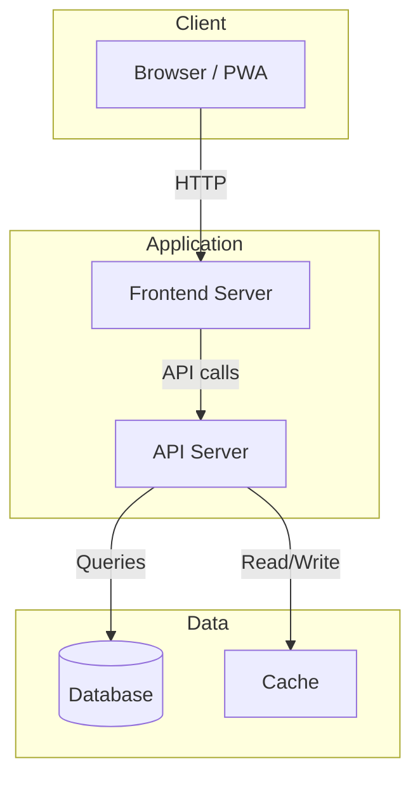
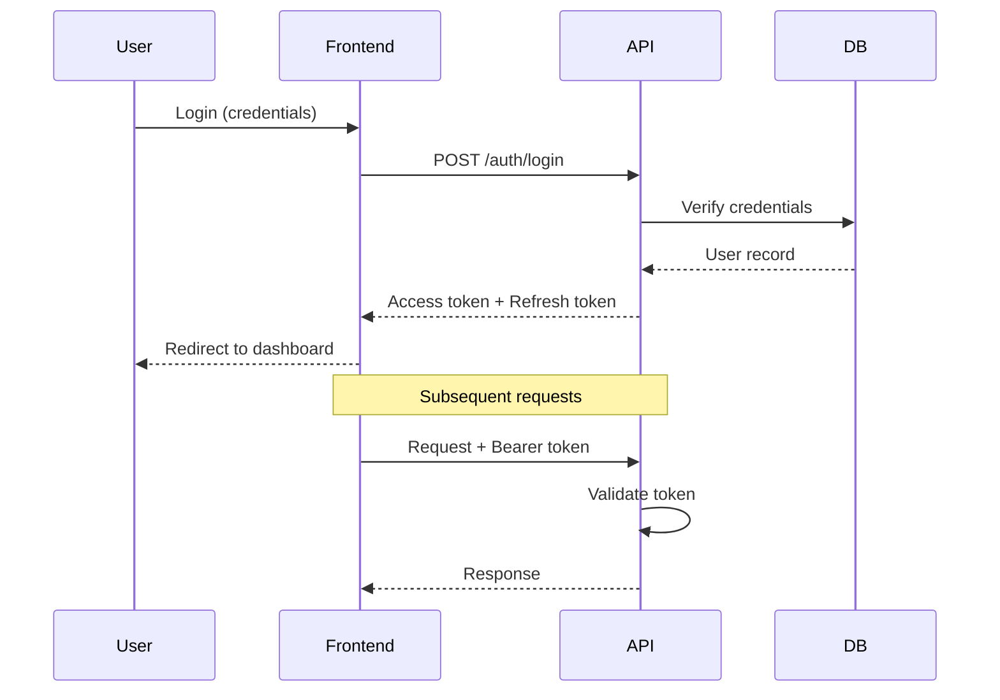
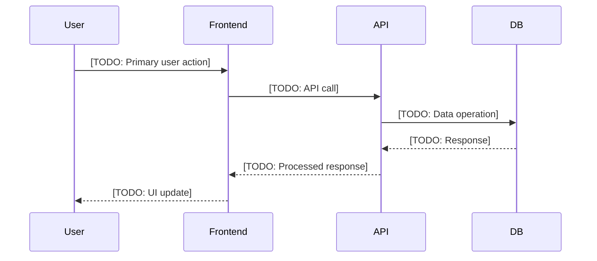

# Data Flow Diagrams

## System Architecture

[TODO: Customize the diagram above to match your system architecture]

## Authentication Flow

[TODO: Customize the authentication flow for your system]

## Primary Data Flow

[TODO: Add additional flow diagrams for key workflows in your application]

## Feature Dataflows

Individual dataflow diagrams for each feature are in `.ai/specs/dataflows/`:

[TODO: Run `/fill-specs` to auto-discover API endpoints and generate per-feature dataflow diagrams]

| Feature | Dataflow File | Status |
|---------|--------------|--------|
| [TODO: feature-name] | [dataflows/feature-name.md](dataflows/feature-name.md) | [TODO] |
